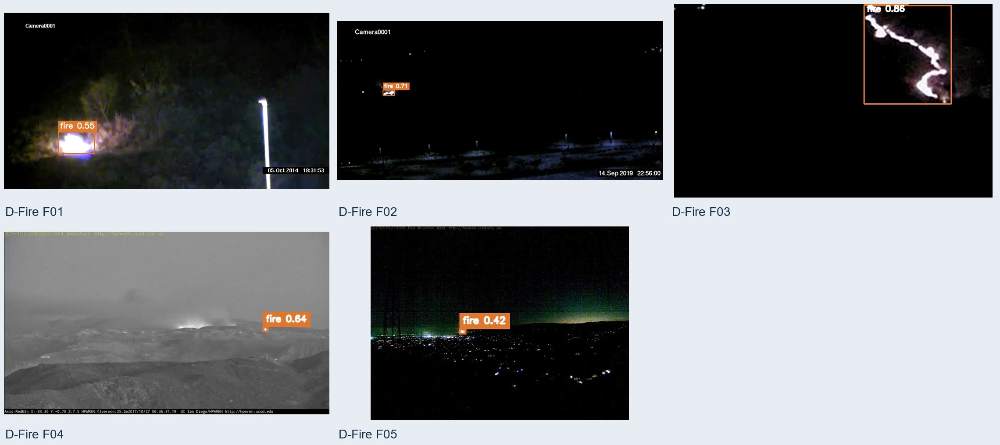
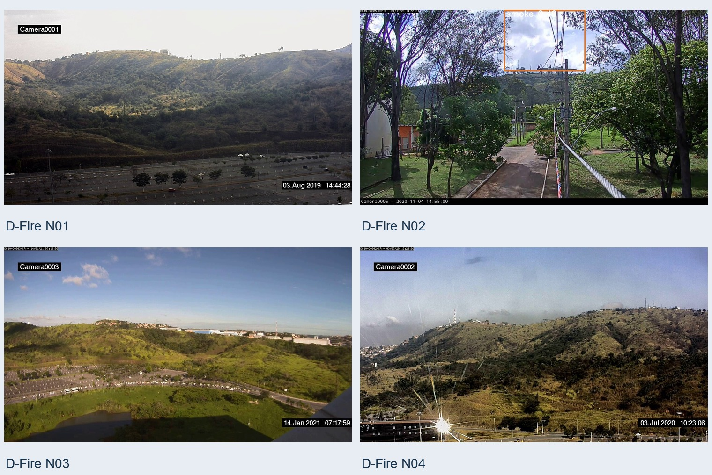
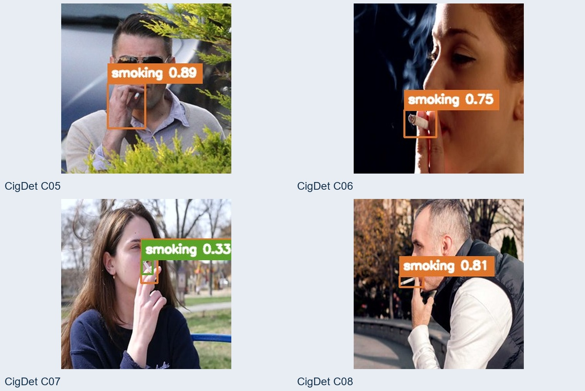

# 利用现有监控，离线识别烟雾、明火和违规吸烟

**不用更换摄像头或 NVR。支持 RTSP、用户现有 go2rtc 批量接入，视频在本地处理，无需上传云端。**

[观看演示视频](demo/README.md) · [下载 v1.0.0](https://github.com/newtv-ai/smokefire/releases/tag/v1.0.0) · [查看部署手册](docs/smokefire-部署手册.pdf) · [查看模型实测](docs/smokefire-模型能力实测手册.pdf) · [提交部署/试点咨询](https://github.com/newtv-ai/smokefire/issues/new?title=%E9%83%A8%E7%BD%B2%2F%E8%AF%95%E7%82%B9%E5%92%A8%E8%AF%A2)

深圳市嘟嘟喵科技有限公司 · 版本 1.0.0 · [English](README.en.md)

## 它解决什么问题

smokefire 给已有视频监控增加三类 AI 辅助告警能力：

- 烟雾检测；
- 明火检测；
- 违规吸烟检测。

它适合服装、鞋材、家具、包装、印刷、仓库、物流中转、电子装配、五金加工等已有监控的场所，也可以作为安防工程商、弱电工程商和消防技术服务机构的辅助巡查方案。

| 核心特点 | 说明 |
|---|---|
| 利用现有设备 | 直接接入摄像机或 NVR 的 RTSP，不要求更换前端设备 |
| 本地离线运行 | 推理、事件和录像保存在部署主机，运行时不依赖云端 AI |
| go2rtc 批量对接 | 用户已有 go2rtc 时，只配置一次 API/RTSP 基址，自动同步全部主码流 |
| CPU / NVIDIA GPU | 提供两套离线 Docker 交付，目标机不需要 Python 或编译环境 |
| 可核验的模型边界 | 公布固定样本、实际检测框、置信度和漏检/误检现象 |

## 演示视频

以下 MP4 是已经带检测框的原始演示视频，复制进仓库时没有重新推理、转码或剪辑：

- [电动车起火检测演示（约 1 分 33 秒）](demo/videos/ebike_fire.mp4)
- [吸烟检测演示（约 45 秒）](demo/videos/吸烟检测.mp4)

视频与全部演示图片集中保存在 [`demo/`](demo/README.md)。

## 公开图片实测

下图来自网上下载的真实公开数据集，可能与现场实际有所出入。检测框由 `fire_smoke_v5.pt` / `smoking_v4.pt` 在默认阈值 `0.30` 下实际推理生成；图片未人工补框，置信度保留两位小数展示。

| 明火样本（5 张） | 烟雾样本（5 张） |
|---|---|
|  |  |

| 烟火同框（4 张） | 无烟火干扰样本（4 张） |
|---|---|
|  |  |

抽烟检测共展示 12 张公开数据集图片：

| C01-C04 | C05-C08 | C09-C12 |
|---|---|---|
|  |  |  |

以上只是固定公开样本的实测结果，不是总体准确率承诺。完整样本编号、结果表和能力边界见[模型能力实测手册](docs/smokefire-模型能力实测手册.pdf)。

## 对接现有 go2rtc

如果用户已经用 go2rtc 管理摄像头，不需要在 smokefire 中逐路重新填写：

```text
用户 go2rtc: GET /api/streams
        ↓ 自动发现主码流、过滤 _sub / -sub / _sd
smokefire 摄像头列表
        ↓
AI 检测、事件截图、录像与 webhook
```

只需配置一次：

```text
API  http://host.docker.internal:1984
RTSP rtsp://host.docker.internal:8554
```

系统只读取用户 go2rtc 的流列表，不修改其配置。上游流消失时，对应摄像头会停用；流恢复后自动重新启用。

## 选择 CPU 还是 GPU

| 版本 | 适合场景 | 下载内容 |
|---|---|---|
| CPU | 功能体验、试点、小规模接入、没有 NVIDIA GPU 的主机 | 一个完整 ZIP |
| NVIDIA GPU | 更高并发需求 | GPU ZIP + 全部 3 个镜像分卷 |

不按某个测试显卡型号承诺兼容性或支持路数。GPU 目标机需要 NVIDIA 驱动、Docker 和 NVIDIA Container Toolkit，并必须使用真实码流完成驱动、显存、持续运行和容量验收。

## 下载与部署

Release 提供两条部署路线，按目标机情况二选一。两条路功能完全一致。

**A. Docker 离线包** —— 目标机不需要 Python，也不需要联网装依赖。

1. 打开 [Release v1.0.0](https://github.com/newtv-ai/smokefire/releases/tag/v1.0.0)。
2. CPU 用户下载 `smokefire-deploy-1.0.0-cpu.zip`；GPU 用户同时下载 GPU ZIP 和全部镜像分卷。
3. 解压后运行 `start.ps1` 或 `start.sh`，脚本第一步会自动校验交付文件。
4. 在服务主机打开 `http://127.0.0.1:8600`。

**B. 源码包** —— 不想在目标机装 Docker 时用，约 90 MB。

1. 下载 `smokefire-source-1.0.0.zip` 并解压。
2. 目标机需自备 Python（推荐 3.12 或 3.13）与 ffmpeg（Linux 还要 libgl1）；首次装依赖需要联网。
3. 解压后运行一条命令：`start.ps1`（Windows）或 `./start.sh`（Linux），加 `-Gpu` / `--gpu` 走 GPU。
4. 首次会自动建 venv 并装依赖，之后同一条命令就是日常启动命令。

详细步骤见[部署手册](docs/smokefire-部署手册.pdf)。

## 首批试点建议

建议先选择 2-4 路有代表性的现有摄像头，连续观察 14 天，覆盖白天、夜间、逆光、遮挡、远近目标和常见干扰物，再根据误报、漏报、录像证据与资源占用决定是否扩大范围。这是建议的验证流程，不代表现场容量或商业服务承诺。

需要部署或试点沟通时，请[新建 Issue](https://github.com/newtv-ai/smokefire/issues/new?title=%E9%83%A8%E7%BD%B2%2F%E8%AF%95%E7%82%B9%E5%92%A8%E8%AF%A2)，说明所在城市、行业、计划接入路数、现有视频接入方式以及 CPU/GPU 环境。

## 文档

- [中文部署手册](docs/smokefire-部署手册.pdf)
- [中文使用操作手册](docs/smokefire-使用操作手册.pdf)
- [中文模型能力实测手册](docs/smokefire-模型能力实测手册.pdf)
- [Deployment Guide](docs/smokefire-Deployment-Guide.pdf)
- [User Operation Manual](docs/smokefire-User-Operation-Manual.pdf)
- [Model Capability Test Guide](docs/smokefire-Model-Capability-Test-Guide.pdf)

> smokefire 是视频 AI 辅助告警工具，不是经认证的火灾报警设备，不能替代法定消防设施、人工巡检、应急流程和现场复核。模型可能误报或漏报。
