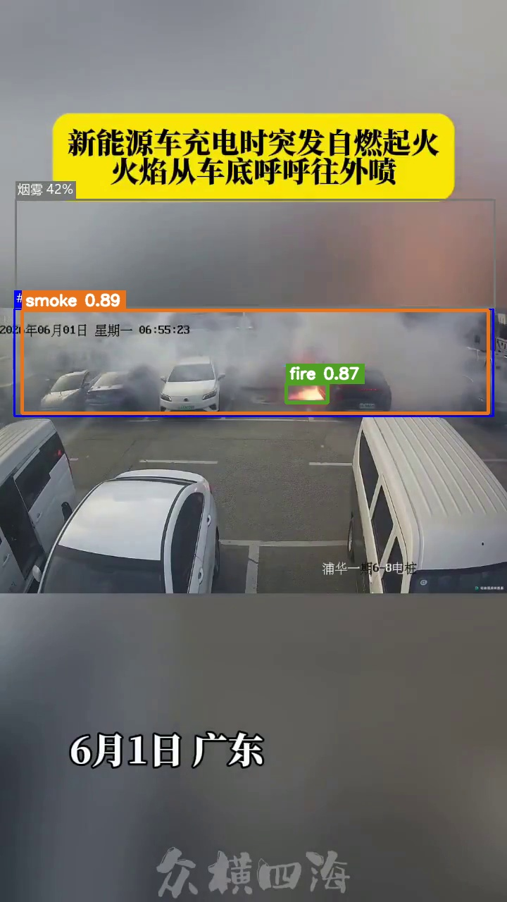
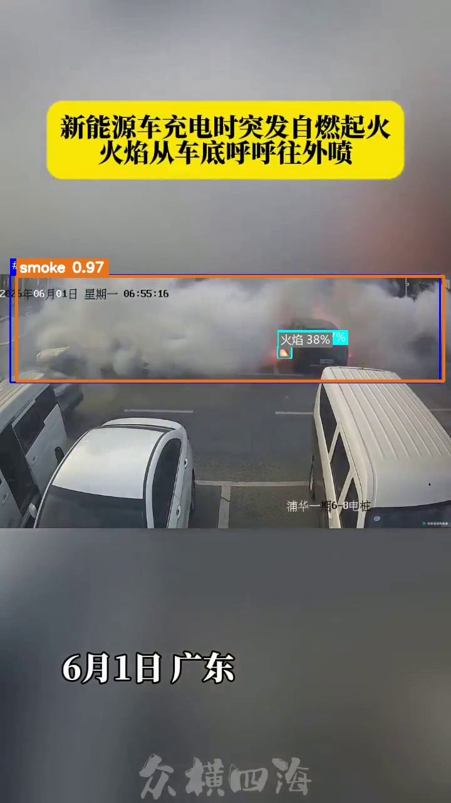
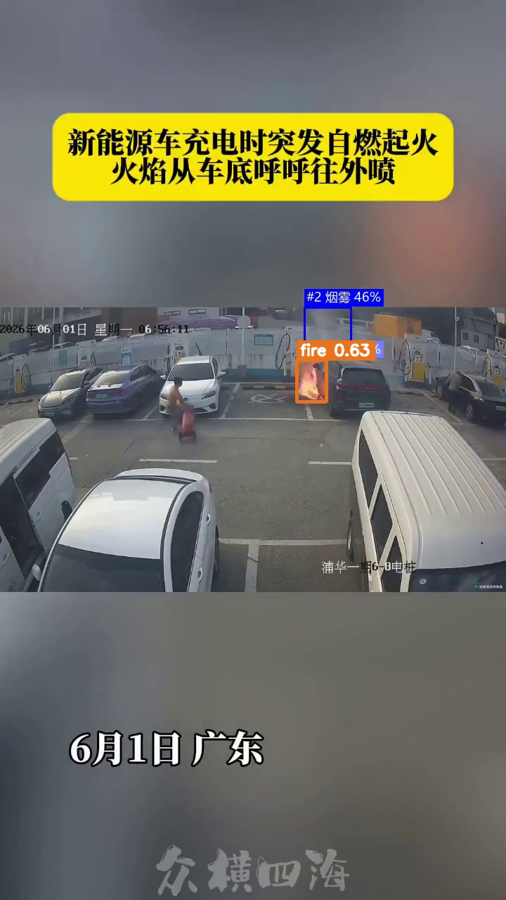
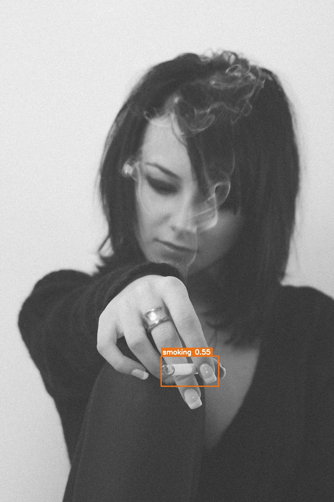
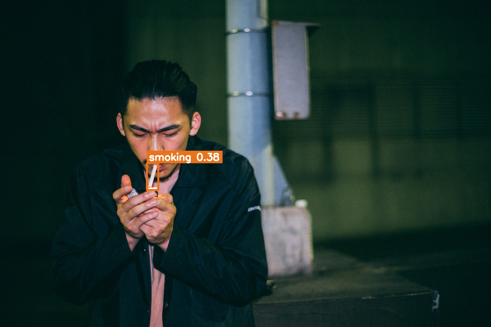

# smokefire Fire, Smoke & Smoking Detection

## Model Capability Test Guide

**Prepared by: Shenzhen Dudumiao Technology Co., Ltd.**  
**Document version: V1.0**  
**Applicable software version: 1.0.0**  
**Test date: 2026-08-03**

> This guide uses real images and video frames to show both capability and limitations. Every box and confidence score was produced by the delivered model weights; no box was added manually. smokefire is an AI-assisted video alerting tool, not a certified fire alarm device and not a substitute for statutory fire protection, human patrols, emergency procedures, or on-site verification.

---

## Document information

| Item | Value |
|---|---|
| Document | smokefire Model Capability Test Guide |
| Audience | Decision makers, implementers, operators, and acceptance teams |
| Models | `fire_smoke_v5.pt`, `smoking_v4.pt` |
| Project | `https://github.com/newtv-ai/smokefire` |

## Contents

1. Executive summary
2. Test method
3. Fire and smoke results
4. Smoking results
5. Event-level replay evidence
6. Capability boundaries
7. Site acceptance guidance

---

## 1. Executive summary

| Capability | Result shown here | Stronger use case | Main limitation |
|---|---|---|---|
| Fire / smoke | High-confidence smoke and fire detections occurred in an e-bike fire video | Visible, sustained fire or smoke | Small early-stage targets, occlusion, glare, steam, fog, and degraded video can change the result |
| Smoking | One licensed close-up scored 0.55 and passed the production threshold; other clear images remained below threshold | Near- or mid-range views where the hand, cigarette, and mouth relationship is visible | Distant people, small cigarettes, occlusion, low resolution, and pose variation create material miss risk |

A successful image only describes that image. It is not an overall accuracy claim. Production acceptance requires representative positive and negative samples from the target cameras.

---

## 2. Test method

The test ran on Windows 11 with an NVIDIA GeForce RTX 4080 Laptop GPU, PyTorch 2.9.1+cu128, Ultralytics 8.4.24, and input size 640. Screenshots retain candidates at or above `0.20` so that rejected low-confidence boxes remain visible. Software 1.0.0 uses these production thresholds:

| Class | Production threshold | Event confirmation |
|---|---:|---|
| Fire | 0.50 | Sample once per second; require 4 consecutive threshold-passing frames |
| Smoke | 0.85 | Sample once per second; require 4 consecutive threshold-passing frames |
| Smoking | 0.50 | Sample once per second; require 4 consecutive threshold-passing frames |

A box in a screenshot does not automatically become an alert. It must pass the class threshold and the consecutive-frame policy.

---

## 3. Fire and smoke results

### 3.1 Fire and smoke visible together

At 39 seconds, the model returned fire `0.87` and smoke `0.89`. Both exceed their production thresholds, and the boxes cover the principal fire and smoke regions.

### 3.2 Dense smoke

At 32 seconds, dense smoke scored `0.97`. Large, persistent smoke with good background contrast is a stronger case for this model.

### 3.3 Smaller late-stage fire and weak smoke

At 87 seconds, fire scored `0.63` and passes the fire threshold. The smoke candidate scored about `0.46`, below the smoke threshold of `0.85`. Each class is evaluated independently.

---

## 4. Smoking results

### 4.1 Close-up that passes the production threshold

With a clear cigarette-and-hand relationship, the model scored `0.55`, above the `0.50` production threshold. For video, subsequent frames must still satisfy the four-frame event rule.

### 4.2 A clear image can still be rejected

Another clear and visually explicit image scored only `0.38`, so it is rejected by the production threshold. This is a real model result, not a mock-up. Smoking detection is sensitive to pose, cigarette scale, hand occlusion, and training distribution.

When the included 44.9-second smoking sample video was sampled once per second, only the 35-second frame produced a candidate (`0.28`), also below the production threshold. Low-quality or distribution-shifted material therefore carries significant miss risk.

---

## 5. Event-level replay evidence

The table below comes from existing event-level replay tests using the delivered weights and the default one-second/four-frame policy. It is closer to production alert logic than a single screenshot, but the dataset is not from the target deployment site.

| Sample group | Fire / smoke | Smoking | Interpretation |
|---|---:|---:|---|
| 28 strong out-of-distribution negative videos | 0/28 formed a fire/smoke event | 2/28 formed a smoking event | Measures interference on this sample set; not the site false-alert rate |
| Positive videos | 7/9 formed a fire/smoke event | 3/8 formed a smoking event | Smoking results were materially affected by low-quality and small-target footage |
| Clear real-world smoking subset | — | 2/2 formed an event | Applies only to those two clips and cannot be generalized as overall recall |

`0/28` must not be marketed as “zero false alarms,” and `7/9` or `3/8` must not be presented as guaranteed project accuracy.

---

## 6. Capability boundaries

- The model can only analyze what the camera captures. Blind spots, occlusion, overexposure, darkness, and compression loss cannot be fully recovered in software.
- A distant flame, cigarette, or thin smoke plume may contain too few pixels even when the source stream is nominally high resolution.
- Steam, fog, reflections, lighting, welding, eating, and handheld objects can share visual features with the target classes.
- Four-frame confirmation reduces isolated false positives but adds alert latency and can miss brief behavior.
- The smoking model is materially more sensitive to low-quality and small-target footage. Sites with low tolerance for misses should collect target-scene data and plan model evaluation or iteration before rollout.
- Confidence is a relative model score for a candidate, not the probability that the real-world event is true, and scores are not directly comparable across models.

---

## 7. Site acceptance guidance

1. Build positive, ordinary-negative, and hard-negative sets from each representative camera view.
2. Cover day, night, backlight, rain/fog, target distance, bitrate, and camera-angle variations.
3. Score whether an event forms; do not rely on a box from one selected frame.
4. Record misses, false alerts, time-to-first-alert, evidence completeness, and compute load per stream.
5. Replay the same sample set after every threshold or policy change, preserving the software version, weight hashes, and results.
6. Keep human verification during pilot operation and expand only after agreed acceptance criteria are met.
