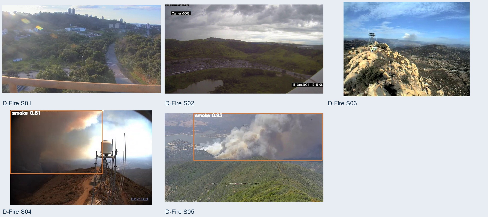
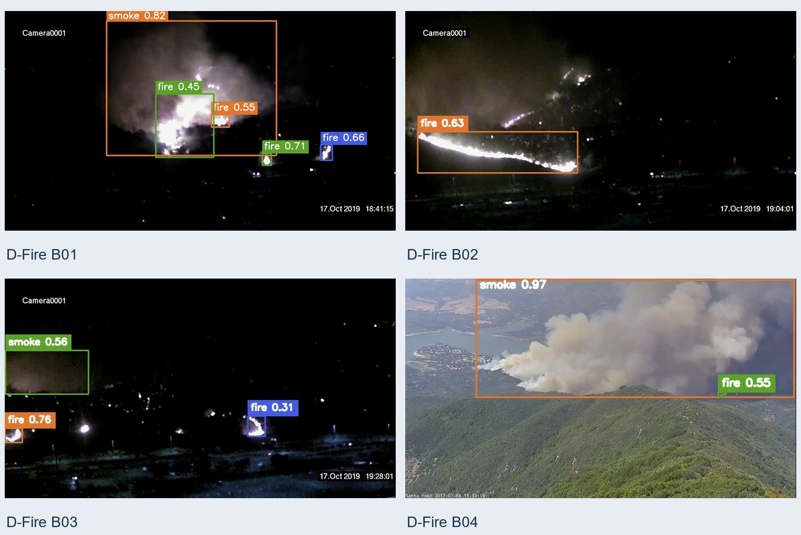
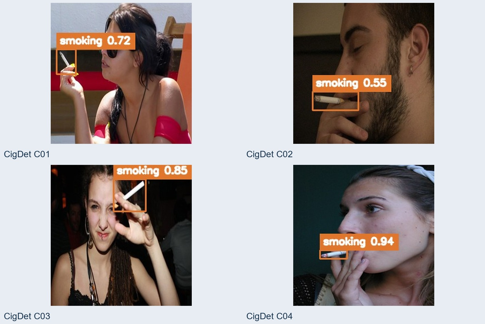
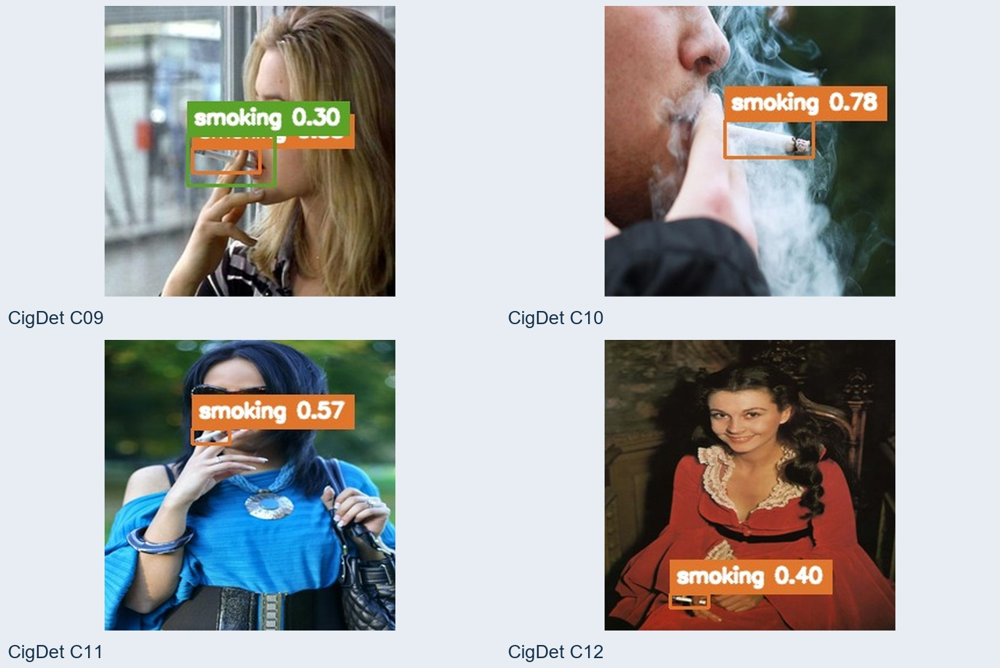

# smokefire Fire, Smoke & Smoking Detection

## Model Capability Test Guide

**Prepared by: Shenzhen Dudumiao Technology Co., Ltd.**  
**Document version: V1.0**  
**Software version: 1.0.0**  
**Test date: August 3, 2026**

> This guide uses real images from public datasets to show actual model output and practical boundaries. smokefire is a video-AI assistance tool, not a certified fire alarm and not a substitute for statutory fire protection, patrols, emergency procedures, or human verification.

---

## Document information

| Item | Value |
|---|---|
| Models | `fire_smoke_v5.pt`, `smoking_v4.pt` |
| Default threshold | `0.30` for every image in this guide |
| Input size | 640 |
| Test sample | 18 D-Fire images plus 12 CigDet images; 30 total |
| Runtime | NVIDIA CUDA validation environment with PyTorch 2.9.1+cu128 and Ultralytics 8.4.24; the validation-host model does not define customer GPU compatibility |
| Project | `https://github.com/newtv-ai/smokefire` |

## Contents

1. Summary
2. Data sources and method
3. Fire results
4. Smoke results
5. Combined fire/smoke results
6. No-fire/no-smoke interference
7. Smoking results
8. Capability boundaries
9. Site acceptance

---

## 1. Summary

| Fixed sample group | Images | Actual result at 0.30 | Interpretation |
|---|---:|---|---|
| D-Fire fire-only | 5 | Fire boxes on 5 images | Responded to visible flames and several distant/night fire points |
| D-Fire smoke-only | 5 | Smoke boxes on 2; no detection on 3 | Distant, thin, or low-contrast smoke remains a clear boundary |
| D-Fire fire-and-smoke | 4 | At least one class on all 4; both classes on 3 | Fire and smoke are evaluated separately in one scene |
| D-Fire neither | 4 | No box on 3; smoke `0.49` on 1 | Clouds, haze, glare, and similar patterns can cause false alerts |
| CigDet positive smoking | 12 | Smoking boxes on all 12; top scores from `0.35` to `0.94` | Stronger on close views with visible hand/cigarette/mouth relationships |

These counts describe only the 30 fixed images shown here. They are not overall accuracy, recall, false-alert rate, or a project guarantee. Public datasets can differ materially from the target cameras.

---

## 2. Data sources and method

### 2.1 Public sources

| Dataset | Use | Official location | License |
|---|---|---|---|
| D-Fire | Fire, smoke, combined, and neither images | `https://github.com/gaia-solutions-on-demand/DFireDataset` | CC0 1.0 |
| CigDet | Real smoking/cigarette scenes | `https://data.mendeley.com/datasets/6hyrr8typ7/1`, DOI `10.17632/6hyrr8typ7.1` | CC BY 4.0 |

D-Fire images were read from samples tagged `dfire` in the public mirror at `https://huggingface.co/datasets/Hajorda/flameye-wildfire-detection`; the official source and license remain the D-Fire repository above. CigDet is credited to Ali Khan, and this guide uses images from its public test set.

### 2.2 Fixed selection and inference

- D-Fire images were sorted by public image ID, then evenly sampled as `5 / 5 / 4 / 4` from fire-only, smoke-only, combined, and neither groups.
- CigDet test images were sorted by filename, then 12 images were selected at even intervals from the 111-image test set.
- Both delivered models used input size 640 and the default `0.30` threshold. Only model-returned boxes at or above `0.30` were drawn.
- No box was selected or added by hand. Misses remain unboxed and false positives remain visible.

> Images were downloaded from real public datasets and may differ from the target site. Every box was generated by actual inference with `fire_smoke_v5.pt` or `smoking_v4.pt`; no box was added manually, and confidence is displayed to two decimal places.

---

## 3. Fire results

| ID | Public image ID | Highest actual output |
|---|---|---:|
| F01 | `dfire_AoF00001` | fire `0.55` |
| F02 | `dfire_AoF04540` | fire `0.71` |
| F03 | `dfire_AoF04591` | fire `0.86` |
| F04 | `dfire_PublicDataset00007` | fire `0.64` |
| F05 | `dfire_PublicDataset00358` | fire `0.42` |

All five produced a box. F05 reached only `0.42`, showing that confidence and stability can fall for distant small targets.

---

## 4. Smoke results

| ID | Public image ID | Highest actual output |
|---|---|---:|
| S01 | `dfire_AoF00002` | No detection |
| S02 | `dfire_AoF06061` | No detection |
| S03 | `dfire_PublicDataset00162` | No detection |
| S04 | `dfire_PublicDataset00469` | smoke `0.81` |
| S05 | `dfire_PublicDataset00648` | smoke `0.93` |

Large plumes with clear boundaries and background contrast scored strongly. Distant, thin, low-contrast smoke or smoke that resembles cloud/haze can be missed.

---

[[PAGEBREAK]]

## 5. Combined fire/smoke results

| ID | Public image ID | Main actual outputs |
|---|---|---|
| B01 | `dfire_AoF04019` | smoke `0.82`; fire up to `0.71` |
| B02 | `dfire_AoF04467` | fire `0.63`; smoke not detected |
| B03 | `dfire_AoF07841` | fire `0.76`; smoke `0.56` |
| B04 | `dfire_PublicDataset00656` | smoke `0.97`; fire `0.55` |

All four produced at least one class, and three produced both. B02 shows that a combined scene does not guarantee that both classes pass the threshold.

---

[[PAGEBREAK]]

## 6. No-fire/no-smoke interference

| ID | Public image ID | Highest actual output |
|---|---|---:|
| N01 | `dfire_AoF00009` | No box |
| N02 | `dfire_AoF01530` | smoke `0.49` |
| N03 | `dfire_AoF03575` | No box |
| N04 | `dfire_AoF07717` | No box |

N02 is a retained real false-positive example. Site tests should include clouds, fog, steam, dust, reflections, welding, and night lighting rather than positive images alone.

---

[[PAGEBREAK]]

## 7. Smoking results

### 7.1 C01-C04

| ID | Source file | Highest actual output |
|---|---|---:|
| C01 | `smoking_0020.jpg` | smoking `0.72` |
| C02 | `smoking_0068.jpg` | smoking `0.55` |
| C03 | `smoking_0122.jpg` | smoking `0.85` |
| C04 | `smoking_0196.jpg` | smoking `0.94` |

[[PAGEBREAK]]

### 7.2 C05-C08

| ID | Source file | Highest actual output |
|---|---|---:|
| C05 | `smoking_0254.jpg` | smoking `0.89` |
| C06 | `smoking_0330.jpg` | smoking `0.75` |
| C07 | `smoking_0374.jpg` | smoking `0.37` |
| C08 | `smoking_0413.jpg` | smoking `0.81` |

[[PAGEBREAK]]

### 7.3 C09-C12

| ID | Source file | Highest actual output |
|---|---|---:|
| C09 | `smoking_0451.jpg` | smoking `0.35` |
| C10 | `smoking_0484.jpg` | smoking `0.78` |
| C11 | `smoking_0528.jpg` | smoking `0.57` |
| C12 | `smoking_0559.jpg` | smoking `0.40` |

Every positive image produced a box at or above `0.30`, but C07, C09, and C12 topped out at only `0.37 / 0.35 / 0.40`. Smoking detection is sensitive to cigarette size, hand occlusion, pose, and distance. These close-view results must not be extrapolated directly to distant surveillance views.

---

## 8. Capability boundaries

- The model can analyze only what the camera captures. Blind spots, occlusion, overexposure, darkness, and compression loss cannot be fully recovered.
- Distant flames, cigarettes, and thin smoke may contain too few pixels even in a nominally high-resolution stream.
- Smoke is especially sensitive to clouds, fog, steam, dust, and background brightness; this fixed sample contains both misses and a false positive.
- CigDet is dominated by close views, while production CCTV is often high-angle and distant. Distribution shift directly changes results.
- Confidence is a relative model score for a candidate, not the probability that the real-world event is true, and scores are not comparable across models.
- A still image validates only one frame. Video alerts also depend on sampling interval, consecutive-frame policy, stream continuity, and compute load.

---

## 9. Site acceptance

1. Build positive, ordinary-negative, and hard-negative samples for every representative camera view.
2. Cover day, night, backlight, rain/fog, distance, bitrate, and camera-angle variation.
3. Establish a baseline at the default `0.30` threshold. If it changes, replay the same set and measure both misses and false alerts.
4. Score whether a video event forms and record time-to-first-alert and evidence completeness.
5. Preserve software version 1.0.0, both model hashes, sample list, and results for reproducibility.
6. Keep human verification during pilot operation and expand only after agreed acceptance criteria are met.

---

**Prepared by: Shenzhen Dudumiao Technology Co., Ltd.**  
**Project: https://github.com/newtv-ai/smokefire**
